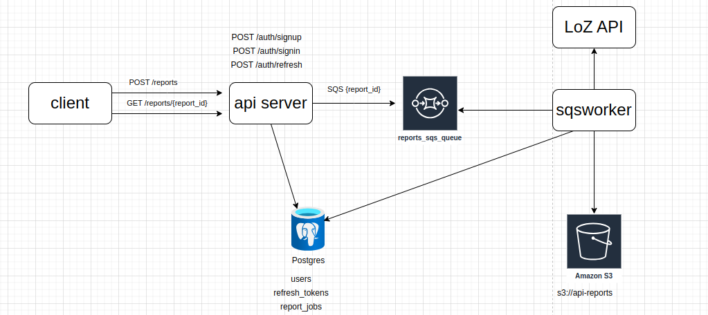

## golang-async-api

This repository is for demo how to implementation async api with golang

## architecture concept



## setup postgresql with docker-compose

```yaml
services:
  postgres:
    restart: always
    image: postgres:16
    container_name: postgres-docker-instance-for-async-api
    volumes:
      - ${HOST_DIR}:/var/lib/postgresql/data
    expose:
      - 5432
    ports:
      - ${POSTGRES_PORT}:5432
    environment:
      - POSTGRES_DB=${POSTGRES_DB}
      - POSTGRES_USER=${POSTGRES_USER}
      - POSTGRES_PASSWORD=${POSTGRES_PASSWORD}
    logging:
      driver: "json-file"
      options:
        max-size: "1k"
        max-file: "3"
```

## setup db migration with go migration

https://github.com/golang-migrate/migrate

```yaml
tasks:
  db_create_migration:
    cmds:
      - migrate create -ext sql -dir migrations -seq {{.table_name}}
    silent: true
    requires:
      vars: [table_name]

  db_migrate:
    cmds:
      - migrate -database $DB_URL -path migrations {{.action}}
    silent: true
    requires:
      vars: [action]
    ## action should be up or down
```

